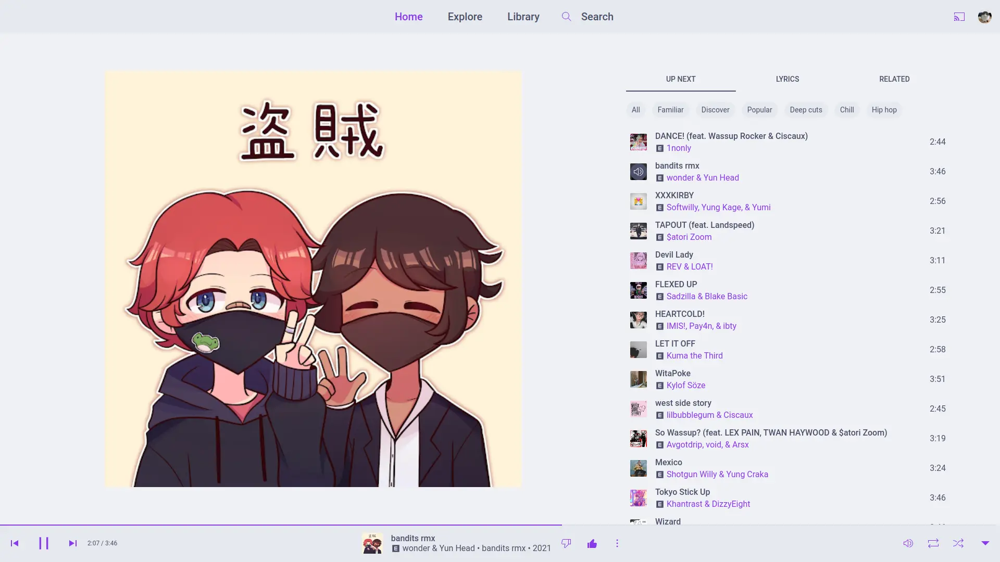
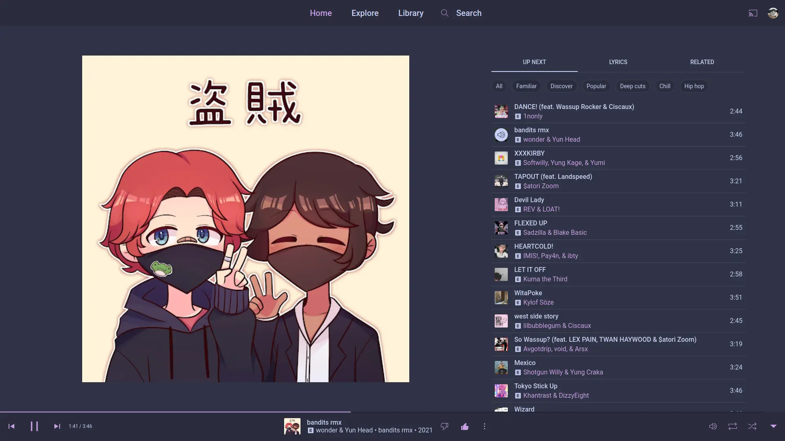
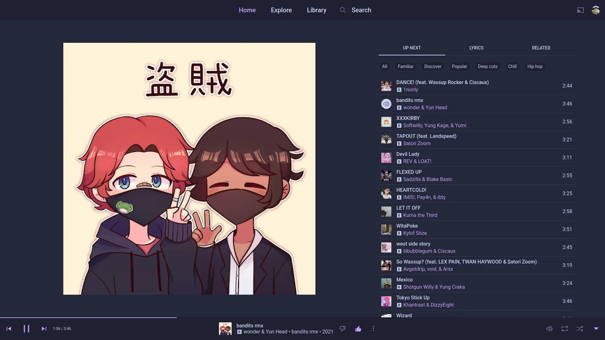
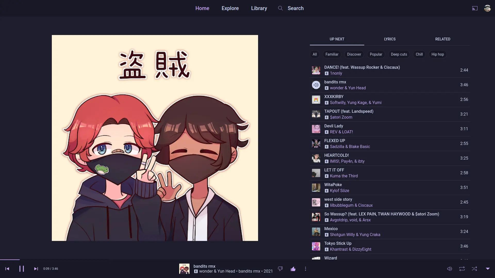

<h3 align="center">
	<br/>
	
	Catppuccin for <a href="https://music.youtube.com">Youtube Music</a>
	
</h3>

<p align="center">
	<a href="https://github.com/catppuccin/youtubemusic/stargazers"></a>
	<a href="https://github.com/catppuccin/youtubemusic/issues"></a>
	<a href="https://github.com/catppuccin/youtubemusic/contributors"></a>
</p>

<p align="center">
  
</p>

## Previews

<details>
<summary>🌻 Latte</summary>

</details>
<details>
<summary>🪴 Frappé</summary>

</details>
<details>
<summary>🌺 Macchiato</summary>

</details>
<details>
<summary>🌿 Mocha</summary>

</details>

## Usage
### [Youtube Music Desktop App (th-ch)](https://github.com/th-ch/youtube-music)
1. Create a new css file with one of the flavour imports below.
2. Assuming you have the latest build with the theme selection menu, open the app, click `Options > Visual Tweaks > Theme > Import custom CSS file`, and choose the CSS file.

### [Youtube Music Desktop App (ytmdesktop)](https://github.com/ytmdesktop/ytmdesktop)

1. Navigate to the settings of the Youtube Music Desktop App.
2. Go to the appearances tab and turn on custom theme.
3. Click on the pencil icon to open up the editor window.
4. Paste in the flavour import for your flavour and press the save button.

### The code
```css
/* latte */
@import url("https://catppuccin.github.io/youtubemusic/src/latte.css");
/* frappe */
@import url("https://catppuccin.github.io/youtubemusic/src/frappe.css");
/* macchiato */
@import url("https://catppuccin.github.io/youtubemusic/src/macchiato.css");
/* mocha */
@import url("https://catppuccin.github.io/youtubemusic/src/mocha.css");

/* if you want to change the accent color, paste this in aswell and change the hex code */
html:not(.style-scope) {
    --accentColor: #f5e0dc !important;
}
```

### [Stylus](https://github.com/openstyles/stylus)
1. Install Stylus extension for [Firefox](https://addons.mozilla.org/en-US/firefox/addon/styl-us/), [Chrome](https://chrome.google.com/webstore/detail/stylus/clngdbkpkpeebahjckkjfobafhncgmne) or [Opera](https://addons.opera.com/en-gb/extensions/details/stylus/)
2. Then install with Stylus (click on the link):
  - [🎧 Catppuccin for Youtube Music](https://github.com/catppuccin/youtubemusic/raw/main/src/youtubemusic.user.css)
3. Choose your flavor and accent color in the Configure window in Stylus Options


## 💝 Thanks to

- [rubyowo](https://github.com/rubyowo)
- [Anubis](https://github.com/anubisnekhet)
- [OceanicSquirrel](https://github.com/OceanicSquirrel)

&nbsp;

<p align="center">
	
</p>

<p align="center">
	Copyright &copy; 2021-present <a href="https://github.com/catppuccin" target="_blank">Catppuccin Org</a>
</p>

<p align="center">
	<a href="https://github.com/catppuccin/catppuccin/blob/main/LICENSE"></a>
</p>
